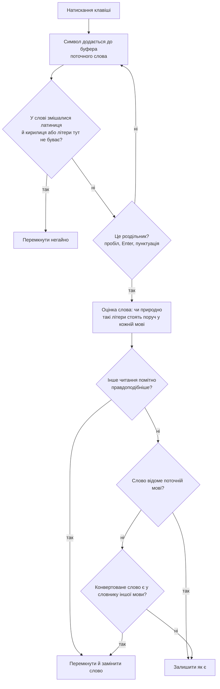

# ⌨️ KeySwitcher — автоперемикання розкладки UA ⇄ EN

Особистий інструмент для Windows, аналог Punto Switcher: стежить за тим, що ви набираєте, і **сам перемикає
розкладку між українською та англійською**, коли слово набрано не тією мовою (`ghbdsn` → `привіт`,
`руддщ` → `hello`).

[](https://github.com/Lion-killer/KeySwitcher/actions/workflows/ci.yml)

> **Статус:** 🧪 **застосунок поки що тестується** — особистий некомерційний проєкт, який щодня працює на
> моїй машині. Правила автоперемикання ще налаштовуються на живому наборі, тож окремі слова можуть не
> перемкнутися або перемкнутися зайве.
>
> **Приватність:** жодних мережевих функцій — застосунок не надсилає нічого нікуди і не потребує ні
> акаунта, ні інтернету.
>
> **Платформа:** Windows 10/11 x64 · .NET 10 · WPF · C# 13
>
> **Ліцензія:** [PolyForm Noncommercial 1.0.0](LICENSE) — користуйтеся вільно (особисто, у навчанні, у неприбуткових організаціях), але **продавати й використовувати комерційно не можна**. Як є, без жодних гарантій.

---

## ✨ Що вміє

| Можливість | Як викликається |
|---|---|
| 🔄 **Автоперемикання розкладки** — за оцінкою літерних сполук | автоматично, на межі слова |
| 🅰️ **Виправлення випадкового CapsLock** (`hELLO` → `Hello`) | автоматично |
| ⌨️ **Ручне перемикання щойно набраного слова** | `Insert` |
| 🖱️ **Розкладка виділеного тексту** | `Ctrl+Shift+F10` |
| 🔠 **Зміна регістру** (`мале → ВЕЛИКЕ → Велике`) | `Ctrl+Shift+F11` |
| 🔤 **Транслітерація** за правилами КМУ 2010 («Євген» → `Yevhen`) | `Ctrl+Shift+F9` |
| ⚡ **Автозаміна скорочень** (`нп` → `наприклад`) | автоматично, на пробілі / Tab / Enter |
| 📖 **Персональний словник** власних слів | вкладка «Словник» |
| 💡 **Пропозиція долучити слово**, яке ви раз-по-раз перемикаєте `Insert` | балон у треї |
| 🚫 **Виключення програм** за `.exe` | вкладка «Виключення» |
| 🇺🇦 **Іконка в треї з прапорцем** поточної мови | автоматично |
| 💾 **Експорт / імпорт налаштувань** | вкладка «Інше» |
| 🚀 **Автозапуск** разом із Windows | вкладка «Загальні» |
| 🔍 **Детальне логування** натискань | вкладка «Загальні» (типово увімкнено) |

### ⌨️ Гарячі клавіші

Усі комбінації змінюються у вкладці «Гарячі клавіші».

| Дія | Типово | Чому саме так |
|---|---|---|
| Ручне перемикання слова | `Insert` | найчастіша дія, мусить працювати на компактних клавіатурах без `Fn` |
| Зміна регістру | `Ctrl+Shift+F11` | рядок `F` вільний у Windows і більшості програм |
| Розкладка виділеного | `Ctrl+Shift+F10` | те саме |
| Транслітерація | `Ctrl+Shift+F9` | те саме |

> **Ціна `Insert`:** він забирається глобально, тож режим заміни (overwrite) у застосунках більше не
> перемикається. Кому він потрібен — змінює комбінацію в налаштуваннях (кнопка `✕` очищає поле).
>
> Якщо комбінація вже зайнята іншою програмою, застосунок не падає: пише попередження в лог і показує
> його у вікні — досить призначити іншу.

---

## 🧠 Як воно вирішує

**Коротко:** застосунок порівнює два читання набраного слова — як є і як буде після перемикання — і
перемикає, якщо друге помітно правдоподібніше. Правдоподібність оцінюється за тим, наскільки звично літери
стоять поруч у кожній мові.



Основне рішення ухвалює не словник, а **оцінка того, наскільки природно літери слова стоять поруч**.
Зразок беруть самі словники: при старті застосунок рахує, як часто в українських словах трапляються
пари сусідніх літер (і так само для англійських) — нічого не закладено в код, тільки те, що є в списках слів.

Далі на кожному слові порівнюються два читання — як набрано і як буде після перемикання. Перемагає те,
чиї сполуки літер звичніші для своєї мови, і то з помітним відривом, інакше слово лишається як є. Саме
тому це працює там, де словник безсилий: «працює» немає в `uk.txt` як окреме слово, але набрана не тією
розкладкою форма `ghfw.'` для англійської неможлива, тому її видно одразу. Виміряно на словниках проєкту:
текст, набраний не тією розкладкою, ловиться у 95,7 % (UA) і 98,0 % (EN) випадків, а правильно набраний
хибно перемикається у 0,32 % / 0,00 %.

Словник лишається підстраховкою для власних назв і коротких слів: для слів із 1–2 літер ця оцінка вимкнена.
Слово, **відоме поточній мові, не чіпається ніколи** — саме тому персональний словник надійно захищає
імена й терміни.

---

## 🚀 Швидкий старт

### Вимоги

- Windows 10 або 11, x64;
- .NET Desktop Runtime 10 — **інсталятор довантажить і поставить його сам**, якщо його немає на машині
  (це єдиний випадок, коли з'явиться запит UAC).

### 📦 Встановлення

1. **Взяти інсталятор** — `KeySwitcherSetup-<версія>.exe` зі `installer\out\`.
2. **Запустити його** — майстер першим ділом спитає, для кого ставити:
   - **лише для мене** (типово) — без запиту прав адміністратора, у `%LocalAppData%\Programs\KeySwitcher`;
   - **для всіх користувачів** — Windows попросить права адміністратора, і тека буде
     `C:\Program Files\KeySwitcher`.
3. **Натиснути «Запустити KeySwitcher»** на останній сторінці — застосунок стартує й сідає в трей.

> **Windows попередить — це нормально.** Інсталятор не підписаний (сертифікат для підпису коштує гроші,
> а проєкт особистий), тому SmartScreen скаже «невідомий видавець»: **«Докладніше» → «Виконати в будь-якому
> разі»**. Деякі антивіруси реагують і на сам застосунок: він перехоплює клавіатуру й інжектить натискання,
> а це саме те, що шукає евристика. У коді немає жодного мережевого виклику — застосунку нікуди писати.


> **Іконку в треї Windows 11 сховає — витягніть її один раз.** Кожна нова піктограма потрапляє під
> галочку «^», і програмно винести її звідти не може ніхто: це рішення Windows, а не застосунку.
> Перетягніть іконку з переповнення на панель мишкою або увімкніть її в «Параметри → Персоналізація →
> Панель задач → Інші піктограми в області сповіщень». Закріплення прив'язане до шляху програми, тож
> переживає оновлення — робити це вдруге не доведеться.

> **Видалення** прибирає файли, ярлики й запис автозапуску та окремо питає, чи видаляти
> `%AppData%\KeySwitcher`: налаштування й власні слова типово лишаються, щоб перевстановлення їх підхопило.

### 🔄 Оновлення

Запустити новий інсталятор поверх старого — він сам закриє працюючий застосунок (Restart Manager),
прибере файли попередньої версії й поставить нову. Налаштування в `%AppData%` не чіпаються.

### 🛠 Збірка з коду

Потрібен **.NET SDK 10** — застосунок зібраний під `net10.0-windows`. Сам файл рішення — `KeySwitcher.slnx`
(новий формат): його відкриває Visual Studio 2022 17.13+ і свіжі версії Rider; якщо ваша IDE його не бачить,
відкривайте три `.csproj` напряму або збирайте з консолі.

```powershell
dotnet build KeySwitcher.slnx --nologo     # або просто dotnet build
dotnet test  KeySwitcher.slnx --nologo     # 401 тест
```

Інсталятор (потрібен [Inno Setup 6](https://jrsoftware.org/isdl.php), `winget install -e --id JRSoftware.InnoSetup`).
Застосунок збирається у двох варіантах: **легкий** (framework-dependent) — .NET береться з системи, і
**самодостатній** (self-contained) — .NET їде разом із застосунком:

```powershell
.\installer\build-installer.ps1                # легкий: інсталятор ~4 МБ
.\installer\build-installer.ps1 -SelfContained # самодостатній: ~51 МБ, .NET на машині не потрібен
.\installer\build-installer.ps1 -SkipPublish   # тільки перепакувати наявний publish
```

Перед перезбіркою застосунок треба закрити — він тримає власні файли: `Stop-Process -Name KeySwitcher.UI -Force`.

### 🚢 Релізи

Історія версій — [`CHANGELOG.md`](CHANGELOG.md): розділ додає скрипт релізу з погодженого тексту, і той
самий текст іде в GitHub Release.

Версія задана в одному місці — `Directory.Build.props`; звідти вона їде у версію exe, в інсталятор і в
назву GitHub Release. Випустити реліз — один скрипт:

```powershell
.\.github\skills\release\scripts\publish-release.ps1 -Bump patch   # або -Bump minor|major, або -Set 1.2.0
```

Він піднімає версію, проганяє тести, збирає інсталятор, пушить код і ставить тег `vX.Y.Z` — далі
[`release.yml`](.github/workflows/release.yml) на GitHub сам збирає інсталятор і створює Release із
прикріпленим файлом (версія з дефісом у тегу стає pre-release). Перед тегом скрипт складає **текст
релізу** (список змін із комітів) і **питає згоду**: поки текст не підтверджено, тег не ставиться.
Відмова нічого не публікує — коміт версії та `main` лишаються, а реліз ні: текст можна доробити у
файлі й повторити запуск з `-Set <версія>`. Опис процесу й застереження — у скілі
[`.github/skills/release/SKILL.md`](.github/skills/release/SKILL.md).

---

## 🖱️ Як користуватися

Застосунок живе **тільки в треї** — окремого вікна в нього немає.

| Дія | Що робить |
|---|---|
| Права кнопка по іконці | меню: «Увімкнено», «Налаштування...», «Вихід» |
| Подвійний клік | вікно налаштувань |
| Іконка в треї | прапорець показує мову активного вікна (`UA` / `EN`) |

Вікно налаштувань має вкладки «Загальні», «Гарячі клавіші», «Виключення», «Словник», «Автозаміна»,
«Інше».

### 🚫 Виключення

Список програм за `.exe` (наприклад `devenv.exe`, `WindowsTerminal.exe`), у яких автоперемикання й заміна
не працюють. Додаються вибором зі списку **відкритих вікон** — не треба нічого шукати руками.

### ⚡ Автозаміна

Пари «скорочення → повний текст»: `нп` → `наприклад`, `тб` → `тобто`. Спрацьовує на пробілі, `Tab` або
`Enter`.

### 📖 Персональний словник

Власні слова — імена, назви, терміни, яких немає у вбудованих списках.

- мова слова визначається першою літерою: кирилиця → український словник, латиниця → англійський;
- власне слово додається лише до перевірки за словником і не змінює загальної оцінки мови;
- слово, відоме поточній мові, **не перемикається ніколи** — це і є захист імен і термінів;
- зміни застосовуються **без перезапуску**.

Якщо якесь слово доводиться перемикати клавішею `Insert` знову й знову, застосунок помітить це сам:
після третього перемикання в треї з'явиться балон, а клік по ньому відкриє налаштування на вкладці
«Словник» і спитає, чи додати слово. Згода дописує його одразу — слово видно у списку й воно діє без
перезапуску; відмова остаточна, більше про це слово не спитають. Слова, які словники вже знають, не
рахуються взагалі.

### 🔌 Ключі запуску

| Ключ | Що робить |
|---|---|
| `--settings` | відкрити вікно налаштувань (коли трей недоступний) |
| `--enable-autostart` | увімкнути автозапуск — цим користується інсталятор |

---

## 📂 Файли й налаштування

| Шлях | Що там |
|---|---|
| `%AppData%\KeySwitcher\settings.json` | налаштування |
| `%AppData%\KeySwitcher\custom-words.txt` | персональний словник (по слову в рядку, `#` — коментар) |
| `%AppData%\KeySwitcher\manual-switches.json` | скільки разів кожне слово перемикали клавішею `Insert` (для пропозиції словника) |
| `%AppData%\KeySwitcher\debug.log` | трасування натискань і рішень (ротація: 256 КБ × 2) |
| `%AppData%\KeySwitcher\error.log` | лише помилки — саме цей файл показують, коли щось зламалося |
| `%LocalAppData%\Programs\KeySwitcher\` | сам застосунок |

> Налаштування зберігаються цілком, тому експортований файл можна покласти на місце `settings.json` руками.
> Власні слова в експорт **не входять** — вони живуть окремим `custom-words.txt`.

```json
{
  "autoSwitch": true,
  "autoSwitchLayout": true,
  "fixCapsLock": true,
  "skipSwitchAfterCaretMove": true,
  "skipSwitchAfterManualSwitch": true,
  "verboseLog": true,
  "autoStart": false,
  "hotkeys": {
    "manualSwitch": "Insert",
    "changeCase": "Ctrl+Shift+F11",
    "selectionLayout": "Ctrl+Shift+F10",
    "transliterate": "Ctrl+Shift+F9"
  },
  "exclusions": ["devenv.exe", "WindowsTerminal.exe"],
  "autoReplace": [
    { "shortcut": "нп", "replacement": "наприклад" }
  ]
}
```

---

## ⚠️ Що варто знати

- 🛡️ **Підвищені вікна** (запущені від адміністратора) застосунок не бачить, якщо сам KeySwitcher не
  підвищений — Windows розділяє ввід за рівнем цілісності. У такому разі раз за сеанс показується балон у треї.
- 🖥️ **Консоль** варто додати у виключення: зміна регістру й перемикання виділеного тиснуть `Ctrl+C`, щоб
  дізнатися, чи є виділення, а в сфокусованій консолі це надсилає `^C` процесу.
- 🚫 **RU розкладки немає** і не буде: підтримуються лише UA ⇄ EN.
- 📖 **Словники — базові форми** («працює» немає, є «праця»), тому відмінювані форми ловить оцінка літерних
  сполук, а не словник.
- 🅰️ **CapsLock виправляється без перевірки його стану** — тому іноді хибно спрацьовує на кшталт
  `eBAY` → `Ebay`.
- 🔤 **Слово з 1–2 літер** оцінює лише словник: для таких слів оцінка літерних сполук вимкнена (у `en.txt` є
  дволітерні `yt`, `nb`, тож короткі слова лишаються як є).
- 🖱️ **Позиція каретки** (`GetCaretPos`) у Chrome, VS Code, Electron повертає `(0,0)`, тому підказки біля
  каретки свідомо немає.
- 🧭 **Немає і не планується:** мережевих функцій, автооновлення, хмарної синхронізації, ML.NET (літери
  розрізняються за діапазонами Unicode — навчати модель нема на чому), helper-процесу для консольних програм.

---

## 🔧 Якщо щось не так

| Симптом | Причина | Що робити |
|---|---|---|
| Слово не перемикається | програма у списку виключень — або вона підвищена, а KeySwitcher ні | прибрати з «Виключень» або запустити KeySwitcher від адміністратора |
| Перемикається те, що не треба | коротке слово або власна назва | додати слово у «Словник»; повернути слово назад клавішею `Insert`; вимкнути захисні паузи на вкладці «Загальні» |
| Гаряча клавіша не діє | комбінацію зайняла інша програма | глянути попередження у вікні налаштувань і призначити іншу |
| У консолі з'явився `^C` | зміна регістру й перемикання виділеного тиснуть `Ctrl+C`, щоб дізнатися про виділення | додати термінал у «Виключення» |
| Застосунок взагалі не реагує | хук не отримує натискань (підвищене вікно) або вимкнено в треї | увімкнути в треї «Увімкнено»; перевірити `debug.log` |
| Windows каже «невідомий видавець» або антивірус свариться | інсталятор не підписаний, а перехоплення клавіатури виглядає підозріло для евристики | SmartScreen: «Докладніше» → «Виконати в будь-якому разі»; додати застосунок у винятки антивірусу |
| Потрібно зрозуміти, чому слово не перемкнулося | — | увімкнути «Детальне логування» і подивитися `%AppData%\KeySwitcher\debug.log` — там видно кожне натискання й рішення |

---

## 🧱 Архітектура

Три проєкти: **Core** — уся логіка без залежності від UI, **UI** — трей і вікно налаштувань, **Tests** —
xUnit.

```
KeySwitcher.slnx
├── KeySwitcher.Core/        # вся логіка, без залежності від UI
│   ├── Native/              # усі звернення до WinAPI (P/Invoke) зібрані тільки тут
│   ├── Hooks/               # перехоплення клавіатури → черга подій (в обробнику нічого, крім запису)
│   ├── Layout/              # визначення мови, таблиця UA↔EN, буфер слова
│   ├── Analysis/            # діапазони Unicode, словники, оцінка літерних сполук
│   ├── Features/            # оркестратор, ручне перемикання, гарячі клавіші, автозаміна, регістр, транслітерація
│   ├── Input/               # вставка тексту: Backspace × N, далі буфер обміну — завжди, без порога за довжиною
│   ├── Diagnostics/         # логи: два файли, докладність перемикається на льоту
│   └── Resources/Dictionaries/  # uk.txt (337 052 слова), en.txt (370 105 слів), вбудовані у збірку
├── KeySwitcher.UI/          # WPF: трей і вікно налаштувань
├── KeySwitcher.Tests/       # xUnit
└── installer/               # KeySwitcher.iss + build-installer.ps1
```

Правило архітектури: `Core` не знає про UI, усі звернення до WinAPI зібрані в `Native/NativeMethods.cs`,
перехоплення клавіатури ставиться лише з потоку UI (той має цикл обробки повідомлень Windows), а працювати
всередині обробника події заборонено — події йдуть через чергу в пам'яті й обробляються асинхронно.

Причини рішень і граблі, на які вже наступили, записані коментарями поруч із кодом — там, де вони й потрібні.

---

## 🧪 Тести

```powershell
dotnet test KeySwitcher.slnx --nologo
```

**401 тест: 400 проходять, 1 пропущено** (`ThresholdTuningTests.Report_MarginDistribution` — це стенд для
ручного заміру точності оцінки, а не перевірка). Автоматично покриті `LayoutConverter`, `WordBuffer`,
`CharsetAnalyzer`, `DictionaryAnalyzer`, `CapsLockFixer`, `WordJudge` (оцінка слів), `AutoSwitchGuard`
(захисні паузи), `ManualSwitchWatchlist` (пропозиція словника), налаштування й логи. Перехоплення
натискань, перемикання мови й вставку тексту перевіряють руками — у Notepad, Chrome і VS Code.

---

## 📄 Ліцензія та сторонні матеріали

Код застосунку — під [**PolyForm Noncommercial 1.0.0**](LICENSE): користуватися, змінювати й
розповсюджувати можна вільно для особистих, навчальних, дослідницьких і неприбуткових цілей;
**продавати застосунок і використовувати його комерційно — не можна**. Це не «open source» в розумінні
OSI, а *source-available*: код відкритий, але з обмеженням на комерцію. Гарантій немає — як є.

Словники написано не мною, тож вони лишаються під ліцензіями своїх авторів:

| Ресурс | Ліцензія | Призначення |
|---|---|---|
| [LibreOffice uk_UA](https://github.com/LibreOffice/dictionaries) | **MPL 1.1** | `uk.txt` — словник і зразок літерних сполук |
| [dwyl/english-words](https://github.com/dwyl/english-words) | **The Unlicense** | `en.txt` — те саме для англійської |
| [Serilog](https://serilog.net/) | Apache-2.0 | логування |

Обов'язкові повідомлення й посилання — у [`THIRD-PARTY.md`](THIRD-PARTY.md), повний текст MPL 1.1 —
у `licenses/MPL-1.1.txt`.

---

<p align="center">
  <b>KeySwitcher</b> — UA ⇄ EN без зайвих натискань
</p>
